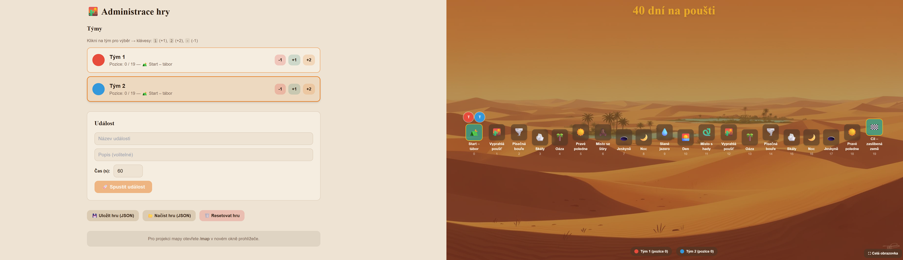

***Jednoduchá vzdělávací interaktivní hra pro podporu na hodinu náboženství, která vychází ze hry aktivity a rozšiřuje ji o pár dalších typů úkolů.***

# 40 dní na poušti

## Před hrou

Připravte si vše potřebné na hru:

- **PC se projektorem a spuštěnou [aplikací](https://napousti.petrkucerak.cz)**, která slouží jako mapa hry,
- **kartičky s úkoly**, které rozložíte před sebe na hromádky podle čísel
- a hrací kostku.

Rozdělte hráče do týmů. Aplikace umí zobrazit od 1 do 6 týmů. Každý tým by si měl vymyslet vlastní jméno.

> [!note]
> Nedoporučují více jak 3 týmy, hra je poté zdlouhavá a je třeba udělat nějaké změny.

## Průběh hry

Týmy se postupně střídají. Na začátku vyberou hráče, který hodí kostkou a podle čísla otočí kartičku. Karty obsahují tyto typy aktivit:

- **úkol** - splňte následující úkol,
- **pantomima** - předveďte pantomimou (scénka bez mluvení a zvuků) danou věc, osobu či situaci
- **kreslení** - nakreslete (bez mluvení, zvuků, gest a psaní písmen či čísel) danou věc, osobu či situaci,
- **mluvení** - popiště danou, osobu či situaci bez toho, aniž byste zmínili kořen slova,
- **událost** - následující event platí do té doby, než se otočí další karta stejného typu.

Na každou aktivitu je časové omezení, které si zvolte sami na začátku hry a zaneste si ho do aplikace. Aplikace vám také umožní zobrazit o jaký typ aktivity se jedná a jaký tým ji realizuje.

Pohyb na mapě:
- za **1. správnou** odpověď `+1`
- za **2. a další správnou** odpověď v sérii `+2`
- za **špatnou** odpověď `-1`

## Konec hry

Tým, který se první dostane do cíle, vyhrává.

> [!note]
> Cílem aktivity je rozpoutat diskuzi, zapálit do daného tématu spíše než do hry.

## Generování kartiček

Pro generování kartiček funguje jedoduchý python skritp, který zavoláte a vygeneruje vám kartičky na základě json zadání. Kartičky si jednoduše vytisknete a zalaminujete.

## Customizace aplikace

Aplikace nemusí být určtena pouze pro dobu postní a putování na poušti. Upravte si ji dle potřeba, pojmenujte si stanoviště jak chcete, nahrajte si do pozadí fotku dle libosti. Aplikace podporuje základní konfiguraci pomocí json formátu. Pro více si udělejte fork repa a zapracujte sami. Budu rád, pokud pošlete merge zpátky.

## Disclaimer

Aplikace je hobby projekt. Neručím za obsah ani za její funkčnost. Obecně rozšiřujte a využívejte dle libosti. Z velké části pro ušetření času se jedné o vibecode, takže feel free používat dále. Budu jen rád, pokud vždy zmíníte zdroj, popr. vše bude vycházet z forku tohoto repa.